<h1 align="center">Cat Wiki</h1>

<div align="center">
   Solution for a challenge from  <a href="https://legacy.devchallenges.io/challenges/f4NJ53rcfgrP6sBMD2jt" target="_blank">Devchallenges.io</a>.
</div>

## Table of Contents

- [Overview](#overview)
  - [Built With](#built-with)
- [Features](#features)
- [Thoughts](#thoughts)
- [Continued Development](#continued-development)
- [How to use](#how-to-use)
- [Useful Resources](#useful-resources)

## Overview

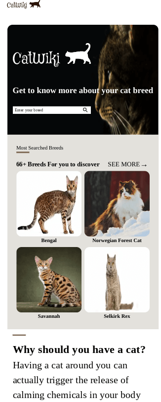

***

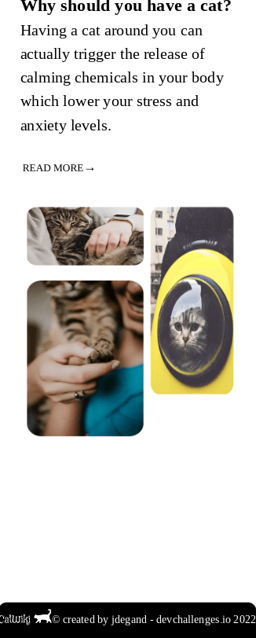

***

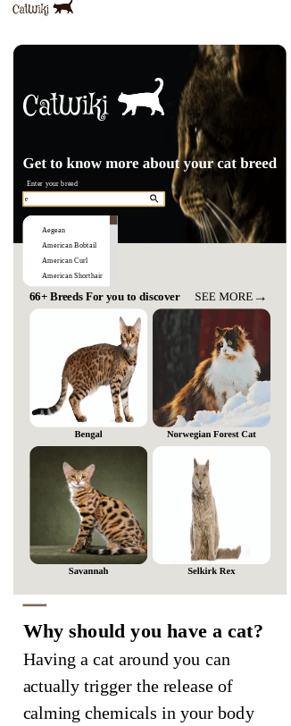

***


***


***

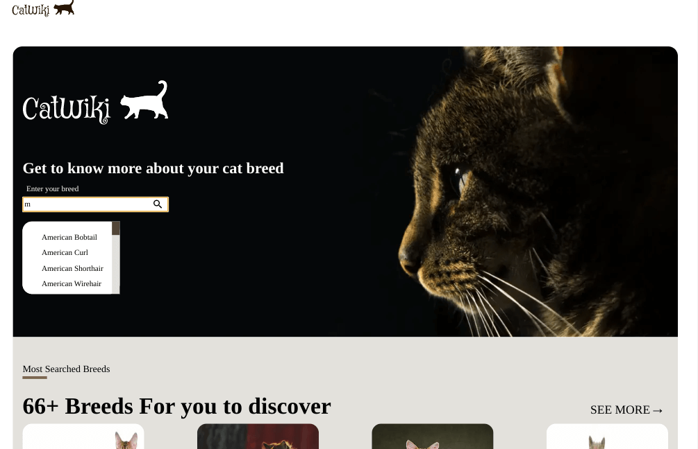

***

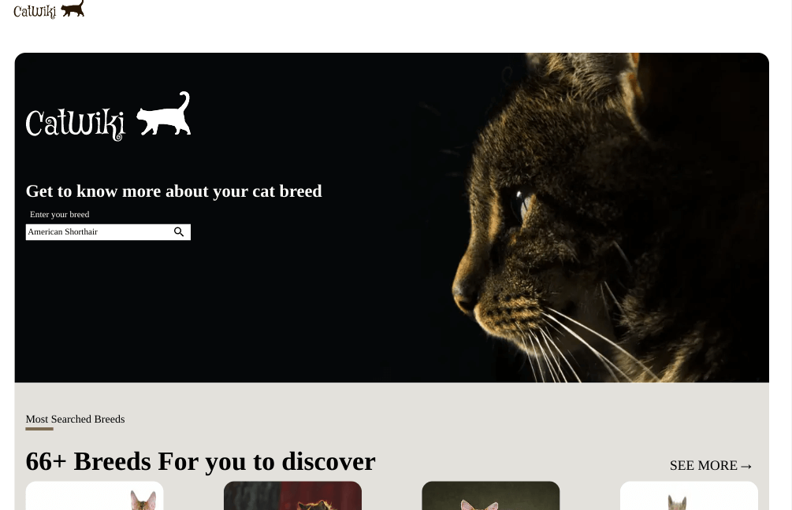

***

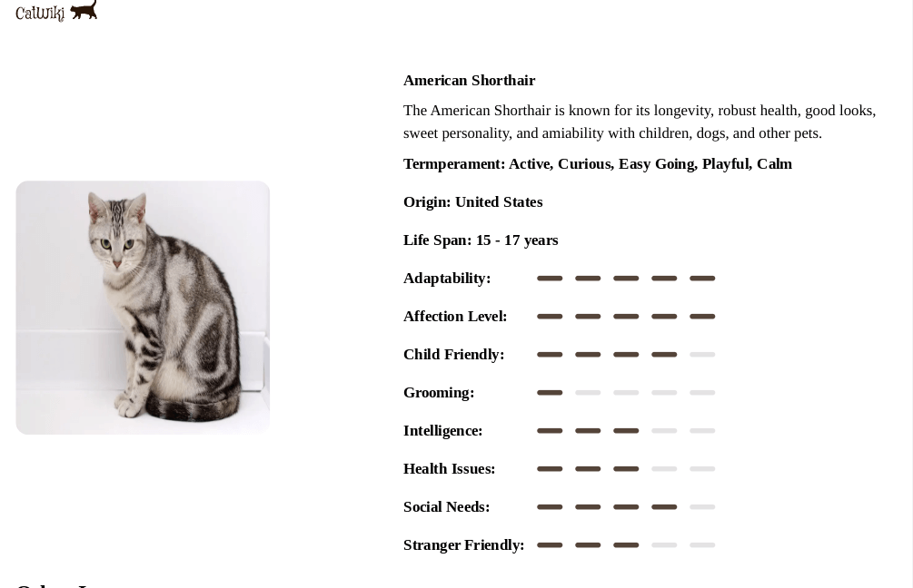

***

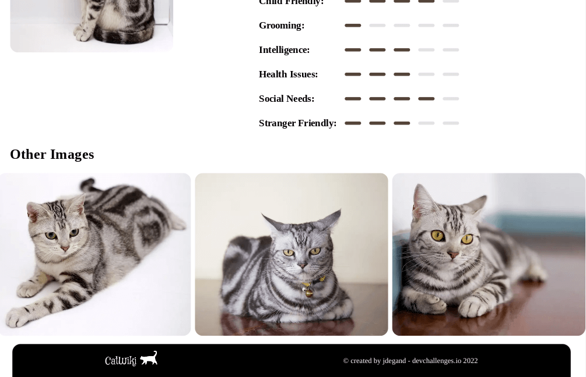

***

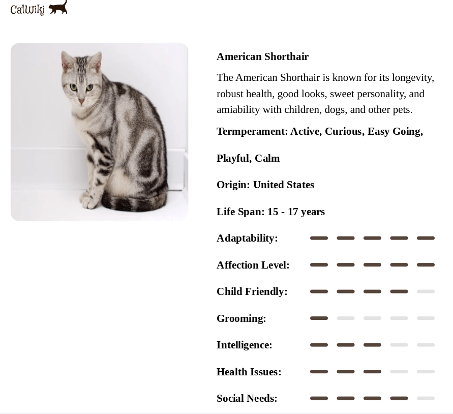

***

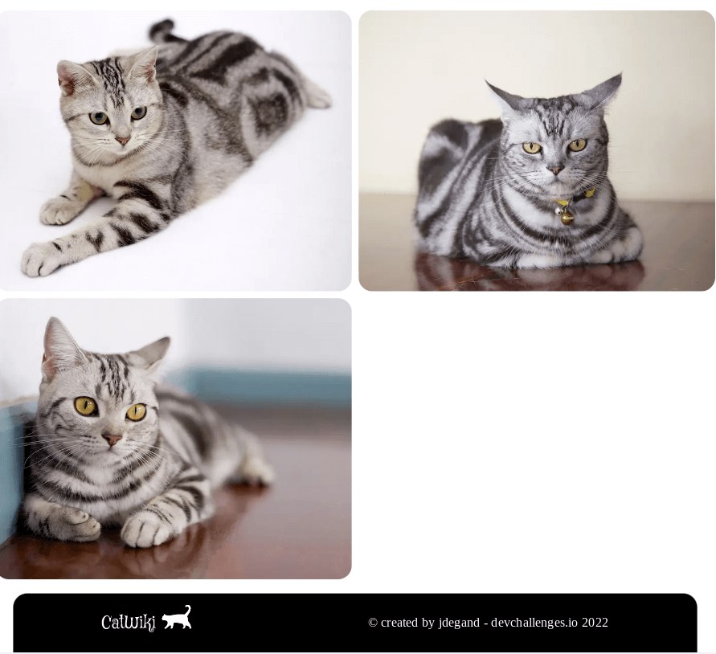

***

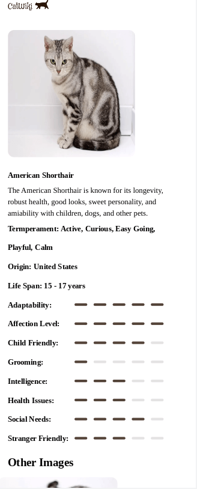

***

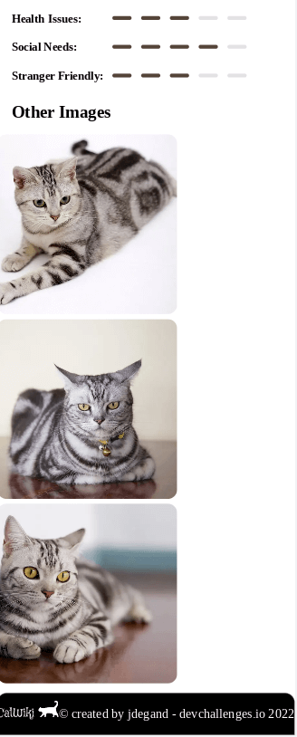

***

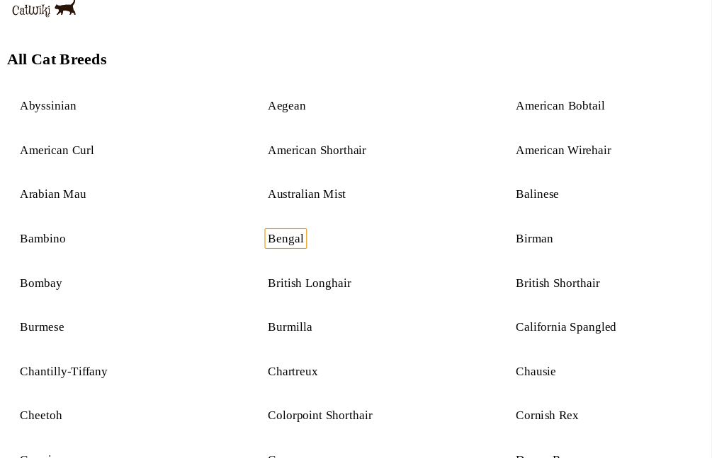

***

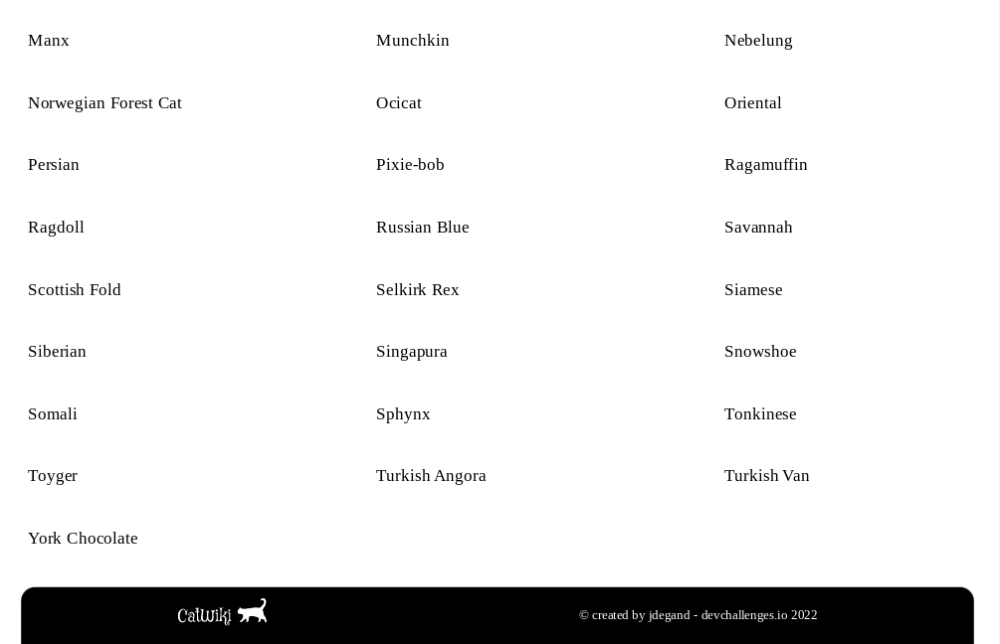

***

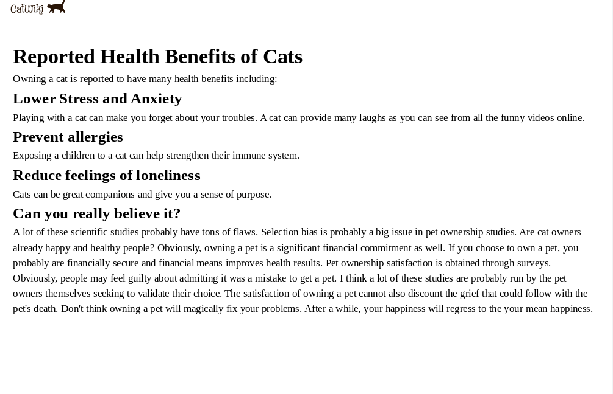

***

### Built With

- [TheCatApi](https://docs.thecatapi.com/)
- [Next](https://nextjs.org/)
- [React](https://reactjs.org/)

## Features

This application/site was created as a submission to a [DevChallenges](https://devchallenges.io/challenges) challenge. The [challenge](https://legacy.devchallenges.io/challenges/f4NJ53rcfgrP6sBMD2jt) was to build an application to complete the given user stories.

- [x]  I can search for cat breeds and select a breed of my choice
- [x]  I can see the most popular searched cat breeds summary on the homepage
- [ ]  I can see the top 10 most searched cat breeds
- [x]  I can see the breed details including description, temperament, origin, life span, adaptability, affection level, child-friendly, grooming, intelligence, health issues, social needs, stranger friendly
- [x]  I can see more photo of the breed
- [ ]  On mobile, when I select the search option, a modal for breed search should pop up
- [x]  I can go to an article about cats when I click read more on Why you should have a cat section
- [ ]  I can go to the top 10 cats by clicking see more in the dashboard

## Thoughts 

- DevChallenges did not add a design for two pages: the breeds index page and the `why you should have a cat` page.  
- You can't search for multiple breeds at once on the API.  You have to use a promise.all() / multiple fetches to get each breed needed, i.e. `/breeds/search?q=beng`.
- You can get 4 random images with image search and the limit parameter, but it is random, and some pictures don't make sense for the design.  Plus, image search gives you no idea of the breed etc.  
- Image component has a lot of quirks and things to be mindful of.  Responsive image optimization is a nightmare.  It shouldn't be this unclear to do things that are extremely easy to do in basic HTML code. Adding a srcSet to the Image component is not really covered.  Having multiple images is not really necessary with the Image component.  So do you use the largest image exclusively? Next does scale down.  Can it scale up from a medium-sized image? 
- There have been many updates to Next Image since I first did this challenge.  I need to investigate more to better optimize images in the app.  
- I used layout="responsive", and under tablet sizes, the background became too small when there was more space available.  You have to set image sizes in the config for device sizes that are not default values.  
- You have to worry about duplicate pictures in the other images section.  
- `Aegean` has the same picture with different IDs, which shows up in the other images section.
- You can use a ref to try and prevent the label from overlapping the text of the input on blur.
- I fixed overlapping by using a valid pseudo-selector on the input in the css.
- Using a layout page caused styling issues.  The minimum height is `100 vh` in `globals.css`, but it seems not to have been applied as the benefits page's footer was not at the bottom of the page.
- There is a problem with the European Burmese detail page. The breed doesn't have a `reference_image_id`.  The API request for the image fails and this prevents the page from showing any content.  Since I am using fetch, the error handling is not as easy or as clean to implement.  
- Originally, the `Read More` and `See More` links were paragraph tags inside the `Link` element.  I changed them to buttons so they can be tabbable.  Similarly, I added buttons to breeds list page so they can easily be tabbed through as well. 
- However, this is problematic as having a button inside an `<a>` tag is illegal in HTML5.  You need to add `baseHref={true}` to the `<Link>` tag so the links will be tabbable.  [See Github for more.](https://github.com/vercel/next.js/discussions/13125)
- When I converted from Next 12 to Next 14, Image had the most breaking changes.  I decided to stick with the legacy image implementation.  
- `images.domains` was deprecated.  I replaced it with `images.remotePatterns`.
- The cat API documentation has improved since I first tackled this challenge.  I could look more into a voting system and the favoriting of breeds.  Doing it may require logins or a local storage cookie to prevent a single user from voting excessively.  
- Next 14 supports Node 16 until early 2024 and then you will need Node 18.  
- I decided not to add TypeScript when converting to App Router.
- I followed this [guide](https://nextjs.org/docs/app/building-your-application/upgrading/app-router-migration) to convert to App Router.  
- Without adding a head.js file, can you change the favicon?  I think you can just put a favicon.ico file in the app folder, but the devchallenges favicon I used is a png file.  
- When copying pages over to the app router, it is best to name them slightly different.   This allows you to keep your original page, as naming conflicts will prevent the app from running.  
- You can't utilize useSearchParams with server-side data loading. 
- This means you have to add 'use client' and use a useEffect to load data with the `searchTerm`. 
- This is a lose-lose situation as useEffect is slower for data fetching, and you have to worry about memory leaks and possibly add a cleanup function.  Adding abort controllers with multiple requests is more involved with less documentation available.  
- You need to add `React Suspense` when using useSearchParams.  Next will throw an error before your state and page updates.    
- I incrementally added all pages to the app router.  I deleted the `pages/_app.js` file and the remaining breed page did not have the correct styling and layout.  It is important to keep your `pages/_app.js` file whenever you are using any page files.    
- I needed to use `encodeURI` on the breed names inside the `Link` hrefs.  Spaces are not allowed inside a link's href. 
- Prior to the Next 14 conversion, I checked for duplicate pictures in the extra images grid.  I have not done that here.  Ultimately, even if you perform a filter to exclude duplicate file names, the API database has entries of the same photo with a different file name.  I documented this issue in my [Angular conversion of this project](https://github.com/jdegand/angular-cat-wiki).

## Continued Development

- Investigate catapi changes
- Benefits page could be refactored to use better semantic html or a FAQ design.   
- Styling tweaks -> Design is not mobile friendly.  
- API error handling improvements
- Typescript ?  
- Testing
- Better dynamic page title implementation
- Filter duplicate image entries from the Breed page

## How To Use

To clone and run this application, you'll need [Git](https://git-scm.com) and [Node.js (v18+)](https://nodejs.org/en/download/) (which comes with [npm](http://npmjs.com)) installed on your computer. From your command line:

```bash
# Clone this repository
$ git clone https://github.com/jdegand/devchallenges-cat-wiki

# Install dependencies
$ npm install

# Before you run the app
# disable telemetry with `npx next telemetry disable` command

# Add .env.local with API_KEY from thecatapi

# Run the app and navigate to localhost:3000
$ npm run dev
```

## Useful Resources

- [Steps to replicate a design with only HTML and CSS](https://devchallenges-blogs.web.app/how-to-replicate-design/)
- [YouTube](https://www.youtube.com/watch?v=R4sdWUI3-mY) - Next Image Optimization
- [YouTube](https://www.youtube.com/watch?v=IVfqp_EIuwc) - Next Background Image
- [Next JS Demo](https://image-component.nextjs.gallery/background) - Image for background
- [Stack Overflow](https://stackoverflow.com/questions/63195562/next-js-set-background-image) - next background image
- [Medium](https://antonball.medium.com/superhero-layout-staggered-css-grid-29430df9520) - staggered css grids
- [Codepen](https://codepen.io/antonjb/pen/vMPgBJ) - staggered grid
- [Stack Overflow](https://stackoverflow.com/questions/65169431/how-to-set-the-next-image-component-to-100-height) - next image component to 100% height
- [YouTube](https://www.youtube.com/watch?v=XMmjeimDDgw) - move placeholder text on focus
- [Codepen](https://codepen.io/Coding-in-Public/pen/BawMyvZ) - floating placeholder
- [Codepen](https://codepen.io/gavinr/pen/djedBm) - search modal
- [YouTube](https://www.youtube.com/watch?v=KW7wJ6d19uA) - search modal
- [DelftStack](https://www.delftstack.com/howto/javascript/filter-array-multiple-values-in-javascript/) - filtering with multiple values
- [Stack Overflow](https://stackoverflow.com/questions/57456191/javascript-find-multiple-objects-by-ids-existing-in-prefined-list-from-an-arra) - find multiple objects by id
- [Next Docs](https://nextjs.org/docs/messages/next-image-unconfigured-host) - next image unconfigured host
- [Stack Overflow](https://stackoverflow.com/questions/61927604/pass-custom-prop-or-data-to-next-js-link-component) - pass data to link component?
- [Kinda Code](https://www.kindacode.com/article/passing-data-via-a-link-component-in-next-js/) -  passing data via a link component
- [Stack Overflow](https://stackoverflow.com/questions/65546154/nextjs-getserversideprops-with-multiple-fetch-requests) - multiple fetch requests with getServerSideProps
- [PluralSight](https://www.pluralsight.com/guides/handling-nested-http-requests-using-the-fetch-api) - nested http requests using fetch api
- [Stack Overflow](https://stackoverflow.com/questions/28250680/how-do-i-access-previous-promise-results-in-a-then-chain) - access previous results in a promise chain
- [YouTube](https://www.youtube.com/watch?v=XThqYaVb8s8) - promise chaining
- [Log Rocket](https://blog.logrocket.com/promise-chaining-is-dead-long-live-async-await-445897870abc/) - promise chaining is dead
- [Stack Overflow](https://stackoverflow.com/questions/71275942/how-to-use-next-js-image-component-with-html-picture-element) - next & picture element
- [Forum](https://forum.thatapiguy.com/t/fetch-bunch-image-breed/243) - fetch multiple images per breed (limit required?)
- [Stack Overflow](https://stackoverflow.com/questions/1960473/get-all-unique-values-in-a-javascript-array-remove-duplicates) - unique values in array
- [Help Guide](https://www.helpguide.org/articles/healthy-living/joys-of-owning-a-cat.htm#:~:text=The%20health%20benefits%20of%20cats&text=They%20can%3A,and%20lower%20your%20blood%20pressure.) - joys of owning a cat
- [The Spruce Pets](https://www.thesprucepets.com/top-mistakes-of-cat-owners-555300) - top mistakes of cat owners
- [Berkeley](https://greatergood.berkeley.edu/article/item/the_science_backed_benefits_of_being_a_cat_lover) - science backed benefits
- [Digital Ocean](https://www.digitalocean.com/community/tutorials/7-ways-to-implement-conditional-rendering-in-react-applications) - conditional rendering in react
- [YouTube](https://www.youtube.com/watch?v=KW7wJ6d19uA) - search modal in vanilla js
- [Stack Overflow](https://stackoverflow.com/questions/16952526/detect-if-an-input-has-text-in-it-using-css-on-a-page-i-am-visiting-and-do-no) - detect if an input has text in it
- [Stack Overflow](https://stackoverflow.com/questions/51842419/next-js-background-image-css-property-cant-load-the-image) - nextjs background image
- [Github](https://github.com/vercel/next.js/issues/18413) - next image problems
- [YouTube](https://www.youtube.com/watch?v=YYxfwDWuPmc) - aspect ratio and responsive next images
- [Github](https://github.com/vercel/next.js/issues/18720) - next image priority issues
- [UploadCare](https://uploadcare.com/blog/next-js-image-optimization/#image-pros-and-cons) - next js images optimization pros and cons
- [Dev.to](https://dev.to/felixhaeberle/responsive-fix-for-the-next-js-image-component-1351) - responsive fix for next js (need a wrapper?)
- [YouTube](https://www.youtube.com/watch?v=P7i5YIJRJew) - explicit width and height error in nextjs
- [Stack Overflow](https://stackoverflow.com/questions/33949469/using-css-modules-how-do-i-define-more-than-one-style-name) - more style name with css modules
- [Stack Overflow](https://stackoverflow.com/questions/4053220/how-can-i-increase-a-scrollbars-width-using-css) - customize scollbar
- [Next](https://nextjs.org/docs/messages/next-image-upgrade-to-13) - next image upgrade to 13
- [Next](https://nextjs.org/docs/pages/api-reference/components/image-legacy#priority) - image legacy priority
- [Github](https://github.com/AdenForshaw/theCatAPI-website) - theCatApi website
- [Github](https://github.com/AdenForshaw/theCatApi-examples) - theCatApi examples
- [YouTube](https://www.youtube.com/watch?v=YQMSietiFm0) - Incrementally adopt the Next.js App Router
- [Reddit](https://www.reddit.com/r/nextjs/comments/xehv28/what_is_the_correct_way_to_handle_errors_inside/?rdt=45064) - what is the correct way to handle errors inside getServerSideProps
- [Next](https://nextjs.org/docs/pages/api-reference/functions/get-server-side-props#redirect) - get server side props redirect
- [Next](https://nextjs.org/docs/app/api-reference/functions/use-router) - useRouter
- [FreeCodeCamp](https://forum.freecodecamp.org/t/javascript-fetch-chain-synchronous/295890) - fetch chain
- [Reddit](https://www.reddit.com/r/nextjs/comments/13kwcax/the_app_router_is_not_productionready_yet/) - app router is not production ready yet 
- [Stack Overflow](https://stackoverflow.com/questions/76609481/how-to-apply-global-css-styles-to-pages-folder-in-next-13) - how to apply global css styles to pages folder in next 13
- [Stack Overflow](https://stackoverflow.com/questions/73114731/multiple-fetch-in-useeffect-fetch-data-depend-on-another-fetch-data) - multiple fetch in useEffect fetch data depend on another fetch data
- [Next](https://nextjs.org/docs/app/building-your-application/data-fetching/patterns) - data fetching patterns
- [Stack Overflow](https://stackoverflow.com/questions/6393827/can-i-nest-a-button-element-inside-an-a-using-html5) - can I nest a button element element inside an a tag using HTML5?
- [Github](https://github.com/vercel/next.js/discussions/13125) - next link tag accessibility concerns
- [MDN Docs](https://developer.mozilla.org/en-US/docs/Web/JavaScript/Reference/Global_Objects/encodeURI) - encodeURI
- [Github](https://github.com/vercel/next.js/discussions/50872) - How to set page title and description if page is "use client" ? #50872